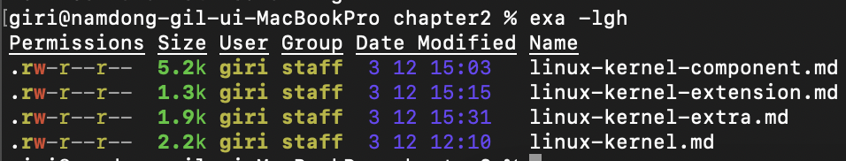
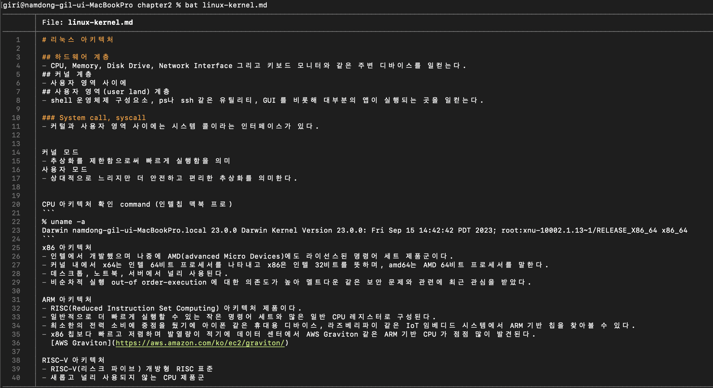
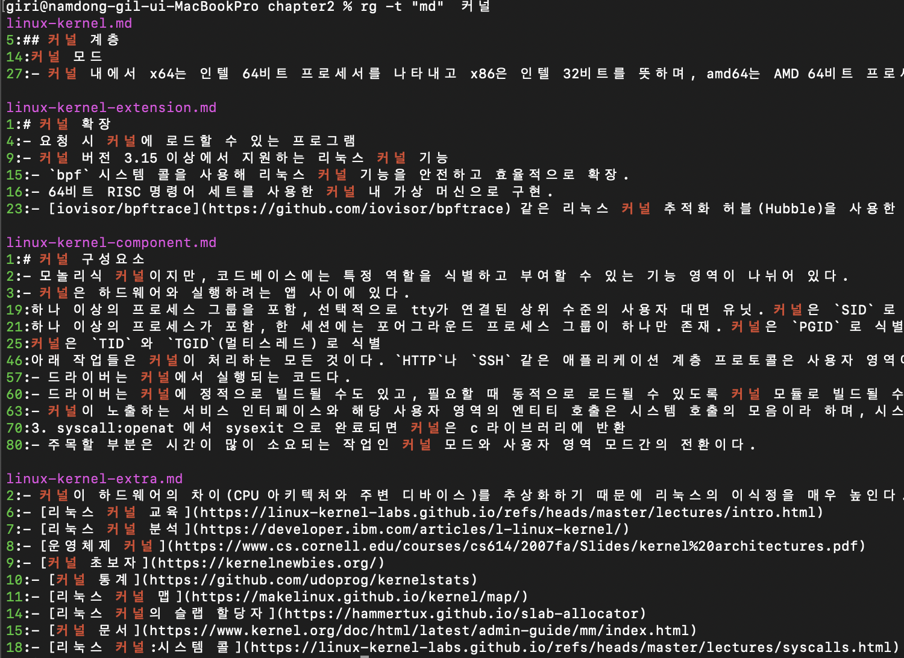

# 기본 개요

## 터미널(terminal)
- 텍스트로 된 사용자 인터페이스를 제공하는 프로그램이다.
- 문자 중심의 입출력, 커서, 화면 처리, 색상 지원이 가능한 이스케이프 시퀀스 또는 이스케이프 코드를 지원.
## 셸(shell)
- 터미널 내부에서 실행되며 명령 인터프리터(interpreter) 역할을 하는 프로그램.
- 스트림을 통해 입출력 처리, 변수 지원, 내장 명령어, 명령 실행 및 상태 처리, 대화식 사용과 스크립트 사용 모두 지원.
- 공식적으로 [sh](https://www.man7.org/linux/man-pages/man1/sh.1p.html) 로 정의, 종종 POSIX 셸이라는 용어를 접하게 되는데, 스크립트와 이식성 맥락에서 중요.
- Bourne Shell 이름을 따 sh 많이 쓰였지만, 최근에 배시(bash) Bourne Again Shell 의 약어로 응용한 이름으로 대체해 널리 쓰임.
- 오늘날에는 콘 셸(Korn Shell)인 ksh, C 셸(csh) 같은 변형 이외에도 본 셸(sh)의 구현은 훨씬 많다.

```
% file -h /bin/sh
/bin/sh: Mach-O universal binary with 2 architectures: [x86_64:Mach-O 64-bit executable x86_64] [arm64e:Mach-O 64-bit executable arm64e]
/bin/sh (for architecture x86_64):	Mach-O 64-bit executable x86_64
/bin/sh (for architecture arm64e):	Mach-O 64-bit executable arm64e
% echo $0
-zsh
```

### 스트림
- 입력(스트림)과 출력(스트림), 줄여서 I/O.
- 셸은 입력과 출력을 위한 기본 파일 디스크립터(File Descriptor(FD)) 모든 프로세스에 제공한다.
    - stdin (FD 0)
    - stdout (FD 1)
    - stderr (FD 2)
- 화면과 키보드에 각각 연결되어 있다. 입력하는 명령은 키보드에서 입력(stdin)을 가져오고 출력(stdout)을 화면에 전달한다.

    - 앰퍼센드(&) - 명령 마지막에 배치되며 백그라운드에서 명령을 실행
    - 백슬래시(\) - 긴 명령의 가독성을 높이기 위해 다음 행에서 명령을 계혹할 때 사용
    - 파이프(|) - 한 프로세스의 stdout 값을 다음 프로세스의 stdin과 연결해 데이터를 파일에 임시로 저장하지 않고 바로 전달 가능
    ```
    curl https://example.com 2> /dev/null | \
    pipe> wc -l
      46
    ```
    - 변수 - 값을 하드코딩하고 싶지 않거나 불가능할 때 언제든 변수를 사용해 값을 저장하고 변경가능
      - 환경변수 - 셸 전체의 설정. env 명령어로 목록을 나열
      - 셸 변수 - 현재 실행 상황에서 유효. 배시에서 set 명령어로 목록을 나열. 하위 프로세스는 셸 변수를 상속하지 않음
    - export 명령어를 사용해 환경변수를 만들 수 있다. 변수의 값에 접근하고 싶을 때는 앞에 $ 붙인다.
    - 변수를 제거하고 싶을 때는 unset 을 사용한다.
    ```
    % set MY_VAR=42
    % set | grep MY_VAR
    '*'=( 'MY_VAR=42' )
    @=( 'MY_VAR=42' )
    argv=( 'MY_VAR=42' )
    % export MY_GLOBAL_VAR="fun with vars"
    % set | grep 'MY_*'
    '*'=( 'MY_VAR=42' )
    @=( 'MY_VAR=42' )
    MY_GLOBAL_VAR='fun with vars'
    argv=( 'MY_VAR=42' )
    % env | grep 'MY_*'
    MY_GLOBAL_VAR=fun with vars
    % bash
    % echo $MY_GLOBAL_VAR
    fun with vars
    $ set | grep 'MY_*'
    MY_GLOBAL_VAR='fun with vars'
    ```
    [배시와 관련된 변수의 전체 목록](https://www.gnu.org/software/bash/manual/html_node/Bash-Variables.html)
### 종료 상태
- `exit status` 를 사용해 명령 실행 완료를 호출자에게 알린다.
  - 정상적인 종료 - `0`
  - 비정상 종료 - `1 ~ 255`
  - 종료 상태를 확인하려면 아래 명령어를 사용
  ```
  echo $?
  0
  ```
  - 일부 셸에서는 마지막 상태값만 사용할 수 있으므로 파이프 사용 시 종료 상태 처리에 주의
    - [$PIPESTATUS](https://www.shellscript.sh/examples/pipestatus/) 를 사용하면 해결 할 수 있다.
    ```
    bash-3.2$  echo 'success sex wow' | grep s | wc -m
      16
    bash-3.2$ echo "Exit statuses: ${PIPESTATUS[0]} ${PIPESTATUS[1]}"
    Exit statuses: 0 0
    ```
### 내장 명령어
- built-in-command 가 존재.
  - yes
  - echo
  - cat
  - read
```
% which ls
/bin/ls
% type ls
ls is /bin/ls
```
### [작업 제어](https://www.digitalocean.com/community/tutorials/how-to-use-bash-s-job-control-to-manage-foreground-and-background-processes)
- 프로세스를 백그라운드에서 시작하려면 명령 마지막에 `&` 넣고, 포어그라운드 프로세스를 백그라운드로 보내려면 `Ctrl+Z`를 누르면 된다.
- 셸을 닫은 후에도 백그라운드 프로세스를 계속 실행하려면 `nohup` 명령을 추가
- 이미 실행 중이지만은 앞에 `nohup`이 붙지 않은 프로세스의 경우에는 이미 실행 이후라도 `disown`을 사용하면 백그라운드 프로세스로 실행 가능
- 실행 중인 프로세스를 제거하려면 다양한 수준의 강제성과 함께 `kill` 사용

## 모던 리눅스 명령어
- cd, ls, find, cat, less 등 자주 사용하는 명령어를 효율적으로 사용하는 것이 좋다.
### [exa](https://the.exa.website/) 
- 배시에서 l을 사용하며 앨리어스로는 `ls -GAhltr` 을 지정하는 방식처럼 `exa` 를 `ls`의 대체 명령어로 사용
---

---
### [bat](https://github.com/sharkdp/bat) 로 파일 내용 보기
- cat 대신 bat 사용
  - 구문 강조 표시 지원
  - 인쇄할 수 없는 문자를 보여주고
  - 깃 지원
  - 자체 페이저 기능
---

---
### [rg](https://github.com/BurntSushi/ripgrep) 로 파일에서 콘텐츠 찾기
- 전통적으로 파일에서 무언가를 찾을 때 `find` 와 `grep` 을 사용
- `rg` 를 통해 손쉽게 사용 가능
---

---
### [jq](https://jqlang.github.io/jq/) 로 처리하는 JSON 데이터
- `awk` 나 `sed` 대신 `jq` 사용
```
% jq '.[] | select(.nick_name == "giri") | .programming_languages' example.json
[
  "rust",
  "golang",
  "java",
  "kotlin"
]
```
### 파일 내용 관리
```
% echo "First line" > /tmp/something
% cat  /tmp/something
First lint

% echo "Second line" >> /tmp/something && \
  cat /tmp/something
First line
Second line

% sed 's/line/LINE/' /tmp/something
First LINE
Second LINE

% cat << 'EOF' > /tmp/another
First line
Second line
Third line
EOF
% cat /tmp/another 
First line
Second line
Third line

% diff -y /tmp/something /tmp/another 
First line								First line
Second line								Second line
								>       Third line
```
### 긴 파일 보기
- `less` 또는 `bat` 로 페이징 처리
- `head` 또는 `tail` 로 특정 부분만 확인
### 날짜와 시간 처리
- `date` 명령어로 고유한 파일 이름 생성 시 유용
- UNIX Timestamp 를 여러 포맷으로 생성하고 변환할 수 있다.
```
% date +%s
1701599550

% date -r 1701599550 '+%m/%d/%Y:%H:%M:%S' 
12/03/2023:19:32:30
```