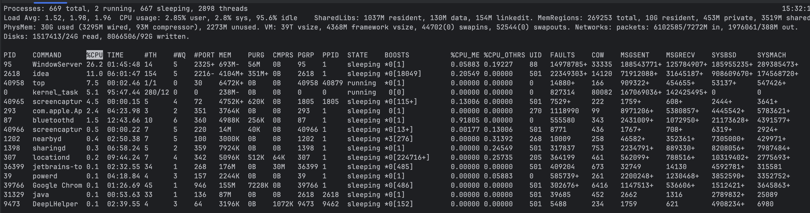

# 모니터링
- 다양한 이유로 시스템과 애플리케이션 지표를 캡처하는 것
  - 작업 소요되는 시간
  - 프로세스가 소모하는 리소스
  - 비정상 시스템의 문제를 해결
- 시간 경과에 따라 하나 이상의 지표 추적
- 조건에 의거한 알림
```
giri ~ %uptime 
15:10  up 14 days,  3:39, 4 users, load averages: 1.79 1.86 1.90

1분, 5분, 15분 cpu 사용량
1.79, 1.86, 1.90
```
특정 작업에 걸리는 시간을 확인 `time` 사용
```
giri ~ %time (ls -R /etc 2 &> /dev/null)
( ls -R /etc 2 &> /dev/null; )  0.00s user 0.01s system 73% cpu 0.013 total
```

## 디바이스 I/O와 네트워크 인터페이스
- `iostat` 으로 I/O 디바이스 모니터링
```
giri ~ %iostat -d -c 3
              disk0               disk2               disk4 
    KB/t  tps  MB/s     KB/t  tps  MB/s     KB/t  tps  MB/s 
   12.55    8  0.10   134.22    0  0.00    43.18    0  0.00 
    5.97   63  0.37     0.00    0  0.00     0.00    0  0.00 
    5.69   45  0.25     0.00    0  0.00     0.00    0  0.00 
giri ~ %diskutil list
/dev/disk0 (internal, physical):
   #:                       TYPE NAME                    SIZE       IDENTIFIER
   0:      GUID_partition_scheme                        *500.3 GB   disk0
   1:                        EFI EFI                     314.6 MB   disk0s1
   2:                 Apple_APFS Container disk1         500.0 GB   disk0s2

/dev/disk1 (synthesized):
   #:                       TYPE NAME                    SIZE       IDENTIFIER
   0:      APFS Container Scheme -                      +500.0 GB   disk1
                                 Physical Store disk0s2
   1:                APFS Volume Macintosh HD - Data     18.3 GB    disk1s1
   2:                APFS Volume Preboot                 2.0 GB     disk1s2
   3:                APFS Volume Recovery                1.2 GB     disk1s3
   4:                APFS Volume VM                      1.1 GB     disk1s4
   5:                APFS Volume Macintosh HD            9.8 GB     disk1s5
   6:              APFS Snapshot com.apple.os.update-... 9.8 GB     disk1s5s1

/dev/disk2 (disk image):
   #:                       TYPE NAME                    SIZE       IDENTIFIER
   0:      GUID_partition_scheme                        +260.0 MB   disk2
   1:                 Apple_APFS Container disk3         260.0 MB   disk2s1

/dev/disk3 (synthesized):
   #:                       TYPE NAME                    SIZE       IDENTIFIER
   0:      APFS Container Scheme -                      +260.0 MB   disk3
                                 Physical Store disk2s1
   1:                APFS Volume DeepL                   151.7 MB   disk3s1

/dev/disk4 (disk image):
   #:                       TYPE NAME                    SIZE       IDENTIFIER
   0:     Apple_partition_scheme                        +22.8 MB    disk4
   1:        Apple_partition_map                         32.3 KB    disk4s1
   2:                  Apple_HFS GoogleUpdater           22.7 MB    disk4s2
                    (free space)                         1.0 TB     -

```
`netstat` 으로 네트워크 인터페이스 모니터링
```
giri ~ %netstat -ctulpn
Active Internet connections
Proto Recv-Q Send-Q  Local Address          Foreign Address        (state)    
tcp4       0      0  192.168.1.28.62974     kix06s19-in-f10..https ESTABLISHED
tcp4       0      0  192.168.1.28.62973     kix06s11-in-f14..https ESTABLISHED
tcp4       0      0  192.168.1.28.62972     a23-40-44-217.de.https ESTABLISHED
tcp4       0      0  192.168.1.28.62967     a104-76-77-35.de.https ESTABLISHED
tcp4       0      0  192.168.1.28.62966     a23-40-44-217.de.https ESTABLISHED
tcp4       0      0  192.168.1.28.62963     a184-25-27-138.d.https ESTABLISHED
tcp4       0      0  192.168.1.28.62962     a184-25-27-138.d.https ESTABLISHED
tcp4       0      0  192.168.1.28.62959     a-0005.a-msedge..https ESTABLISHED
tcp4       0      0  192.168.1.28.62957     server-13-225-13.https ESTABLISHED
tcp4       0      0  192.168.1.28.62956     server-54-230-61.https ESTABLISHED
tcp4       0      0  192.168.1.28.62954     kix06s11-in-f1.1.https ESTABLISHED
tcp4      63      0  192.168.1.28.62952     192.0.73.2.https       CLOSE_WAIT 
tcp4       0      0  192.168.1.28.62951     104.18.40.222.https    ESTABLISHED
tcp4       0      0  192.168.1.28.62946     lb-140-82-114-26.https ESTABLISHED
tcp4       0      0  192.168.1.28.62943     104.18.32.7.https      ESTABLISHED
tcp4       0      0  192.168.1.28.62941     172.64.147.34.https    ESTABLISHED
tcp4       0      0  192.168.1.28.62940     104.18.43.226.https    ESTABLISHED
tcp4       0      0  192.168.1.28.62934     a23-194-70-16.de.https ESTABLISHED
tcp4       0      0  192.168.1.28.62933     a23-194-70-16.de.https ESTABLISHED
tcp4       0      0  192.168.1.28.62932     a23-194-70-16.de.https ESTABLISHED
tcp4       0      0  192.168.1.28.62914     151.101.40.193.https   ESTABLISHED
tcp4       0      0  192.168.1.28.62912     104.18.43.226.https    ESTABLISHED
tcp4       0      0  localhost.63342        localhost.62910        ESTABLISHED
tcp4       0      0  localhost.62910        localhost.63342        ESTABLISHED
tcp4       0      0  localhost.63342        localhost.62901        ESTABLISHED
tcp4       0      0  localhost.62901        localhost.63342        ESTABLISHED
tcp4       0      0  localhost.63342        localhost.62899        ESTABLISHED
tcp4       0      0  localhost.62899        localhost.63342        ESTABLISHED
tcp4       0      0  localhost.63342        localhost.62897        ESTABLISHED
tcp4       0      0  localhost.62897        localhost.63342        ESTABLISHED
tcp4       0      0  localhost.63342        localhost.62895        ESTABLISHED
tcp4       0      0  localhost.62895        localhost.63342        ESTABLISHED
tcp4       0      0  192.168.1.28.62882     146.75.92.193.https    ESTABLISHED
tcp6       0      0  namdong-gil-ui-m.62751 ipad.49274             ESTABLISHED
^C
```

`lsof` (list open files) 권한 있는 TCP 포트를 나열(루트 권한 필요)
```
giri ~ %lsof -i TCP:1-1024
COMMAND     PID USER   FD   TYPE             DEVICE SIZE/OFF NODE NAME
identitys  1193 giri   36u  IPv6 0xe1b9f91958abeee5      0t0  TCP namdong-gil-ui-macbookpro.local:1024->[fe80:18::9d93:9c45:f97e:97a]:1024 (ESTABLISHED)
identitys  1193 giri   55u  IPv6 0xe1b9f91959d63ee5      0t0  TCP namdong-gil-ui-macbookpro.local:1024->[fe80:19::bb70:bb55:346d:db16]:1024 (ESTABLISHED)
identitys  1193 giri   71u  IPv6 0xe1b9f91959d656e5      0t0  TCP namdong-gil-ui-macbookpro.local:1024->[fe80:1c::e65:e2e2:eda5:700f]:1024 (ESTABLISHED)
Google    39777 giri   21u  IPv4 0xe1b9f922f20cb53d      0t0  TCP 192.168.1.28:62946->lb-140-82-114-26-iad.github.com:https (ESTABLISHED)
Google    39777 giri   27u  IPv4 0xe1b9f922f1fb2bed      0t0  TCP 192.168.1.28:62749->stackoverflow.com:https (ESTABLISHED)
Google    39777 giri   31u  IPv4 0xe1b9f922f1faf335      0t0  TCP 192.168.1.28:62980->kix06s11-in-f10.1e100.net:https (ESTABLISHED)
Google    39777 giri   32u  IPv4 0xe1b9f922f1fe0095      0t0  TCP 192.168.1.28:62963->a184-25-27-138.deploy.static.akamaitechnologies.com:https (ESTABLISHED)
Google    39777 giri   33u  IPv4 0xe1b9f922f1fe1745      0t0  TCP 192.168.1.28:62962->a184-25-27-138.deploy.static.akamaitechnologies.com:https (ESTABLISHED)
Google    39777 giri   34u  IPv4 0xe1b9f922f07fe9e5      0t0  TCP 192.168.1.28:62912->104.18.43.226:https (ESTABLISHED)
Google    39777 giri   38u  IPv4 0xe1b9f922f1fb153d      0t0  TCP 192.168.1.28:62979->172.64.144.177:https (ESTABLISHED)
Google    39777 giri   40u  IPv4 0xe1b9f922f1fbb335      0t0  TCP 192.168.1.28:62981->172.64.147.34:https (ESTABLISHED)
Google    39777 giri   41u  IPv4 0xe1b9f922f0800095      0t0  TCP 192.168.1.28:62914->151.101.40.193:https (ESTABLISHED)
Google    39777 giri   45u  IPv4 0xe1b9f922f1f8a53d      0t0  TCP 192.168.1.28:62983->kix06s05-in-f8.1e100.net:https (ESTABLISHED)
Google    39777 giri   47u  IPv4 0xe1b9f922f1fdf53d      0t0  TCP 192.168.1.28:62998->a23-193-53-132.deploy.static.akamaitechnologies.com:https (ESTABLISHED)
Google    39777 giri   48u  IPv4 0xe1b9f922f19cd335      0t0  TCP 192.168.1.28:62956->server-54-230-61-40.icn54.r.cloudfront.net:https (ESTABLISHED)
Google    39777 giri   49u  IPv4 0xe1b9f922f1fb2095      0t0  TCP 192.168.1.28:62984->kix07s07-in-f14.1e100.net:https (ESTABLISHED)
Google    39777 giri   50u  IPv4 0xe1b9f922f1f8b095      0t0  TCP 192.168.1.28:62985->kix07s07-in-f2.1e100.net:https (ESTABLISHED)
Google    39777 giri   51u  IPv4 0xe1b9f922f1fbe095      0t0  TCP 192.168.1.28:62987->kix06s05-in-f10.1e100.net:https (ESTABLISHED)
Google    39777 giri   53u  IPv4 0xe1b9f922f19cf53d      0t0  TCP 192.168.1.28:62957->server-13-225-131-93.icn54.r.cloudfront.net:https (ESTABLISHED)
Google    39777 giri   54u  IPv4 0xe1b9f922f0800bed      0t0  TCP 192.168.1.28:62990->kix07s06-in-f1.1e100.net:https (ESTABLISHED)
Google    39777 giri   55u  IPv4 0xe1b9f922f1f88335      0t0  TCP 192.168.1.28:62988->kix07s06-in-f2.1e100.net:https (ESTABLISHED)
Google    39777 giri   58u  IPv4 0xe1b9f922f19d0bed      0t0  TCP 192.168.1.28:62993->a104-76-75-227.deploy.static.akamaitechnologies.com:https (ESTABLISHED)
Google    39777 giri   63u  IPv4 0xe1b9f922f20ca9e5      0t0  TCP 192.168.1.28:62992->kix06s10-in-f1.1e100.net:https (ESTABLISHED)
Google    39777 giri   64u  IPv4 0xe1b9f922f1fafe8d      0t0  TCP 192.168.1.28:62991->kix06s10-in-f1.1e100.net:https (ESTABLISHED)
Google    39777 giri   68u  IPv4 0xe1b9f922f1f8c745      0t0  TCP 192.168.1.28:62989->tk-in-f156.1e100.net:https (ESTABLISHED)
Google    39777 giri   71u  IPv4 0xe1b9f922f1fdde8d      0t0  TCP 192.168.1.28:62999->a23-193-53-132.deploy.static.akamaitechnologies.com:https (ESTABLISHED)
Google    39777 giri   72u  IPv4 0xe1b9f922f19cde8d      0t0  TCP 192.168.1.28:62994->a104-76-75-227.deploy.static.akamaitechnologies.com:https (ESTABLISHED)
Google    39777 giri   74u  IPv4 0xe1b9f922f1fe0bed      0t0  TCP 192.168.1.28:63000->a23-193-53-132.deploy.static.akamaitechnologies.com:https (ESTABLISHED)
Google    39777 giri   76u  IPv4 0xe1b9f922f1fbf745      0t0  TCP 192.168.1.28:63001->a23-193-53-132.deploy.static.akamaitechnologies.com:https (ESTABLISHED)
Google    39777 giri   77u  IPv4 0xe1b9f922f1fde9e5      0t0  TCP 192.168.1.28:62997->a23-193-53-132.deploy.static.akamaitechnologies.com:https (ESTABLISHED)
Google    39777 giri   79u  IPv4 0xe1b9f922f19b29e5      0t0  TCP 192.168.1.28:63010->104.18.40.222:https (ESTABLISHED)
Google    39777 giri   81u  IPv4 0xe1b9f922f1f899e5      0t0  TCP 192.168.1.28:62934->a23-194-70-16.deploy.static.akamaitechnologies.com:https (ESTABLISHED)
Google    39777 giri   87u  IPv4 0xe1b9f922f1fbd53d      0t0  TCP 192.168.1.28:63002->a104-76-75-227.deploy.static.akamaitechnologies.com:https (ESTABLISHED)
Google    39777 giri   88u  IPv4 0xe1b9f922f19b1e8d      0t0  TCP 192.168.1.28:63009->kix07s07-in-f1.1e100.net:https (ESTABLISHED)
Google    39777 giri   89u  IPv4 0xe1b9f922f1fbebed      0t0  TCP 192.168.1.28:63003->a104-76-75-227.deploy.static.akamaitechnologies.com:https (CLOSED)
Google    39777 giri   90u  IPv4 0xe1b9f922f1fbbe8d      0t0  TCP 192.168.1.28:63004->a104-76-75-227.deploy.static.akamaitechnologies.com:https (ESTABLISHED)
Google    39777 giri   92u  IPv4 0xe1b9f922f19b1335      0t0  TCP 192.168.1.28:63006->a23-193-53-132.deploy.static.akamaitechnologies.com:https (ESTABLISHED)
Google    39777 giri   94u  IPv4 0xe1b9f922f19b353d      0t0  TCP 192.168.1.28:63011->192.0.73.2:https (CLOSE_WAIT)
Google    39777 giri   96u  IPv4 0xe1b9f922f19b4095      0t0  TCP 192.168.1.28:63012->stackoverflow.com:https (ESTABLISHED)
Google    39777 giri  103u  IPv4 0xe1b9f922f19b4bed      0t0  TCP 192.168.1.28:63013->kix07s07-in-f1.1e100.net:https (ESTABLISHED)
Google    39777 giri  109u  IPv4 0xe1b9f922f1feb095      0t0  TCP 192.168.1.28:63016->a23-193-52-206.deploy.static.akamaitechnologies.com:https (ESTABLISHED)
Google    39777 giri  110u  IPv4 0xe1b9f922f1fea53d      0t0  TCP 192.168.1.28:63020->a23-194-70-16.deploy.static.akamaitechnologies.com:https (CLOSED)
Google    39777 giri  112u  IPv4 0xe1b9f922f1fe8e8d      0t0  TCP 192.168.1.28:63018->49.69.95.34.bc.googleusercontent.com:https (ESTABLISHED)
```
`losf` 프로세스 중심 뷰. PID 를 알고 있는 경우 lsof를 사용하여 파일 디스크립터와 I/O 등을 추적
```
$ lsof -p 5299
```

## 통합 성능 모니터
- 텍스트 사용자 인터페이스(TUI) 를 제공
  - 여러 리소스 유형(CPU, RAM, I/O) 지원
  - 대화식 정렬과 필터링(프로세스별, 사용자별, 리소스별)
  - 실시간으로 업데이트되며, 프로세스 그룹, cgroup, 네임스페이스와 같은 세부 정보까지 확인 가능
- [top](https://linux.die.net/man/1/top) 예시

- htop
  - top 보다 빠르고 사용자 인터페이스도 더 나은 개선 버전
- atop
  - top 강력한 대안.
- below
  - cgroup v2 인식.
- neoss
  - 네트워크 트래픽 모니터링용으로 멋진 TUI 제공. ss 대안
- mtr
  - 네트워크 트래픽 모니터링용. traceroute 대신 사용

## 계측
- 지표를 내보내도록 코드를 만드는 방법
- 자동계측(개발자 추가작업 없음)
- 사용자화 계측(코드 스니펫을 수동으로 삽입)
- 풀 기반(pull-based) 나 스크레이핑(scraping): 애플리케이션이(보통 http 엔트포인트를 통해) 지표를 노출하고, 에이전트는 엔트포인트를 호출해 메트릭을 검색한다.

