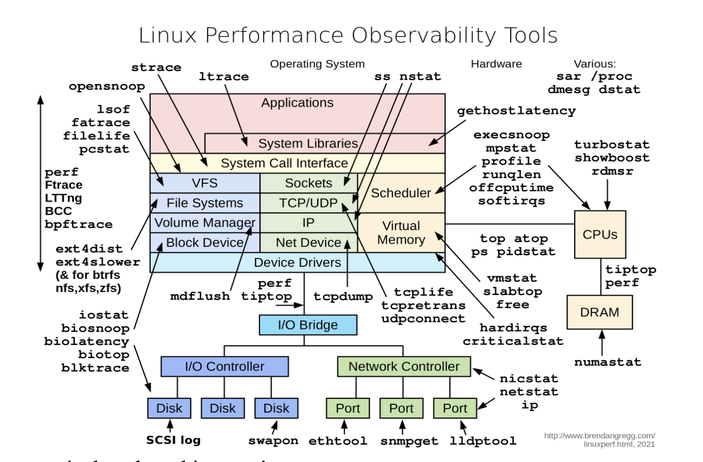

# 관층가능성 개요
- 커널에서부터 사용자를 대면하는 부분까지 스택 전체에서 어떤 일이 일어나고 있는지
- 적합한 도구를 채택항여 가시성 확보
  - 프로세스가 소비하는 메모리 양 파악
  - 디스크 공간이 얼마나 빨리 소진되는지
  - 보안상의 이유로 맞춤 이벤트에 대한 알림 받기
- 시스템, 애플리케이션 로그, 지표, 프로세스 추적
- cpu 주기, 메모리, I/O 트래픽
- [리눅스 성능 사이트](https://www.brendangregg.com/linuxperf.html)

## 전략
- 우다(OODA) 루프(Observation, Orient, decide, act) 관측된 데이터를 기반으로 가설을 테스트하고 조치를 취하는 구조화된 방법.
    - 애플리케이션이 느린 이유를 여러 후보로 가정(cpu 주기, 메모리, 네트워크 i/0 부족)
    - 각 리소스가 얼마나 소비되는지 측정
    - 각 리소스 할당을 개별적으로 변경
    - 결과 측정
## 용어
- 관측가능성
  - 외부 정보를 측정하여 시스템(리눅스 등)의 내부 상태를 평가하는 것. 일반적으로 후속 조치를 취한다. 예를 들어 시스템이 느리게 반응하는 것을 느껴 사용 가능한 주 메모리 양을 측정하여 특정 앱이 모든 메모리를 독차지하는 상화응ㄹ 발견한다면 해당 앱을 종료.
- 시그널 유형
  - 텍스트 페이르도(사람이 검색하고 해석하는 데 가장 적합), 숫자 페이로드(기계에 적합하며, 처리된 형태라면 사람에게도 유용)
    - 로그: json 을 이용해 구조화된 로깅을 하고 타임스탬프를 지정.
    - 지표(metric): 대부분 정기적으로 샘플링된 숫자 데이터 포인트로, 시계열을 형성하며 일종의 집계나 그래픽 표현을 사용하고 특정 조건이 충족되면 알림을 받기도 한다.
      - 카운터: 값이 올라갈 수만 있다. 서비스에서 총 처리한 총 요청 수나 일정 기간 동안 인터페이스를 통해 전송된 바이트
      - 게이지: 올라가거나 내려간다. 사용 가능한 전체 메인 메모레나 실행 중인 프로세스 수
      - 히스토그램: 값의 분포를 보여주는 정교한 방법. 전체 데이터가 어떻게 구성되어 있는지 평가 가능
    - 추적(trace): 런타임 정보의 동적 모음( 특정 원인에 대해 프로세스가 사용하는 시스템 콜에 대한 정보나 커널의 이벤트 시퀀<)
    
- 소스
  - 시그널을 생성하는 곳. 리눅스 운영체제, 애플리케이션 등
- 목적지
  - 시그널을 소비,저장,추가적으로 처리하는 곳. 사용자 인터페이스를 노출하는 목적지를 프론트엔드. 로그 뷰어, 시계열을 표시하는 대시보드
- 텔레메트리
  - 소스에서 시그널을 추출하고 시그널을 목적지로 전송(또는 라우팅, 배송)하는 프로세스. 시그널을 수집 및 전처리(피렅, 다운샘플링)하는 에이전트를 사용하는 경우가 많음
